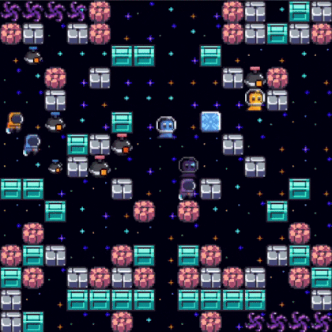
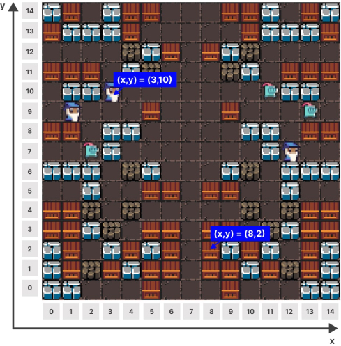
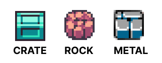
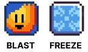
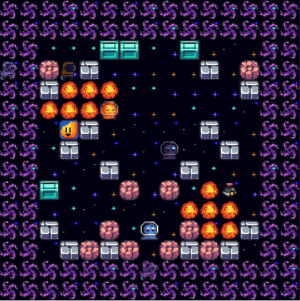

In **Bomberland** you control a team of units navigating a 2D gridworld filled with traps and powerups. Your goal is to take down your opponent's units and **be the last team left standing**.

> See the [Release Notes](https://github.com/CoderOneHQ/bomberland/blob/master/CHANGELOG.md) for a summary of changes since the last season.

## Objective

Bomberland is played by 2 agents. Each agent controls 3 individual units.

On each game tick, an agent can send at most 1 action to each unit. Additional actions sent during a game tick will be dropped by the game server.

- Each unit starts with 3 HP.
- A unit loses 1 HP each time it is struck by an exploding bomb or fire.
- After being hit, units will have an invulnerability period of 5 ticks.
- When a unit loses all its HP, it is considered a dead unit and can no longer send actions.

When an agent loses all its units, it's game over. The team with at least one unit left alive is crowned the winner.

If the last remaining units of both Agents reach 0 HP on the same game tick, the game will be considered a tie.

## Map

The game takes place on a 15x15 grid as shown below:

## Actions

The game server ticks every 100 ms.

On each game tick, the game server will accept one of the following actions from a unit:

- Move in a cardinal direction (up ⬆️, left ⬅️, down ⬇️, right ➡️)
- Place a bomb 💣
- Detonate a bomb 💥

Units can only move to empty tiles. Actions are resolved in the order listed [here](../docs/api-reference#-server-packets-events).

If **multiple** units try to move to the same empty tile on the same tick, the game engine will **drop all actions** and none of the units will move. 

Check [🕹️ Action Packets](../docs/api-reference/#%EF%B8%8F-action-packets) for documentation on sending actions.

## Remote Bombs

### Ammunition

- Each unit starts the game with (effectively) unlimited ammunition.
- Each unit can only have 3 bombs placed on the map at any one point in time.

### Remote detonation

- Bombs can be remotely detonated at any time ≥ 5 ticks after being placed.
- Bombs will automatically explode 40 ticks after they've been placed.

### Detonation behavior

- A detonating bomb hits any units or blocks with a (starting) blast diameter of 3 tiles (i.e. an explosion will spawn on the current location of the bomb, and to the bottom, top, left, and right of it).
- A blast will last for 5 ticks. During this time, units passing through an explosion will take 1 HP of damage (unless they are invulnerable).
- Bombs can also detonate early if they are hit by a neighboring exploding bomb.

## Environment Entities

There are 3 types of blocks in the game:

1. **Crates (Wooden Blocks)** - can be destroyed by a bomb with 1 hit.
1. **Space rocks (Ore Blocks)** - can be destroyed by bombs in 3 hits.
1. **Metal debris (Metal blocks)** - indestructible (except by end-game fire).

There are 2 types of items that have a chance of spawning once a block is destroyed:

1. **Blast Powerup**: Extends bomb blast radius by 1 unit in each direction.
1. **Freeze Powerup**: Temporarily stuns a random opponent unit for 15 ticks.

Pickups will perish after 40 ticks, or if hit by an explosion or end-game fire.

## Ring of Fire
After 200 ticks, the map will start to gradually fill up with end-game flames.

Getting hit by end-game flames will incur 1 HP of damage (unless invulnerable).

## End-game fire behavior

-   Fire starts in the top-left and bottom-right corners of the map.
-   Fire spawns in a spiral towards the center of the map (starting along the horizontal axis).
-   Fire spawns every 2 ticks.
-   Fire instantly destroys all blocks and pickups and detonates bombs.
